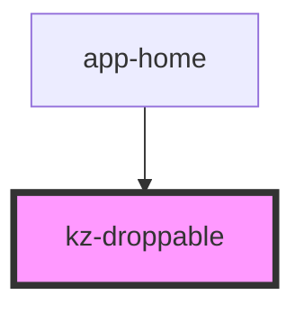

# kz-droppable

<!-- Auto Generated Below -->

## Properties

| Property | Attribute | Description | Type                     | Default     |
| -------- | --------- | ----------- | ------------------------ | ----------- |
| `input`  | --        |             | `IDroppableControlInput` | `undefined` |

## Events

| Event            | Description | Type               |
| ---------------- | ----------- | ------------------ |
| `elementDropped` |             | `CustomEvent<any>` |

## Methods

### `complete(ev: any, data: any) => Promise<void>`

#### Returns

Type: `Promise<void>`

## Dependencies

### Used by

 - [app-home](../app-home)

### Graph

----------------------------------------------

*Built with [StencilJS](https://stenciljs.com/)*
